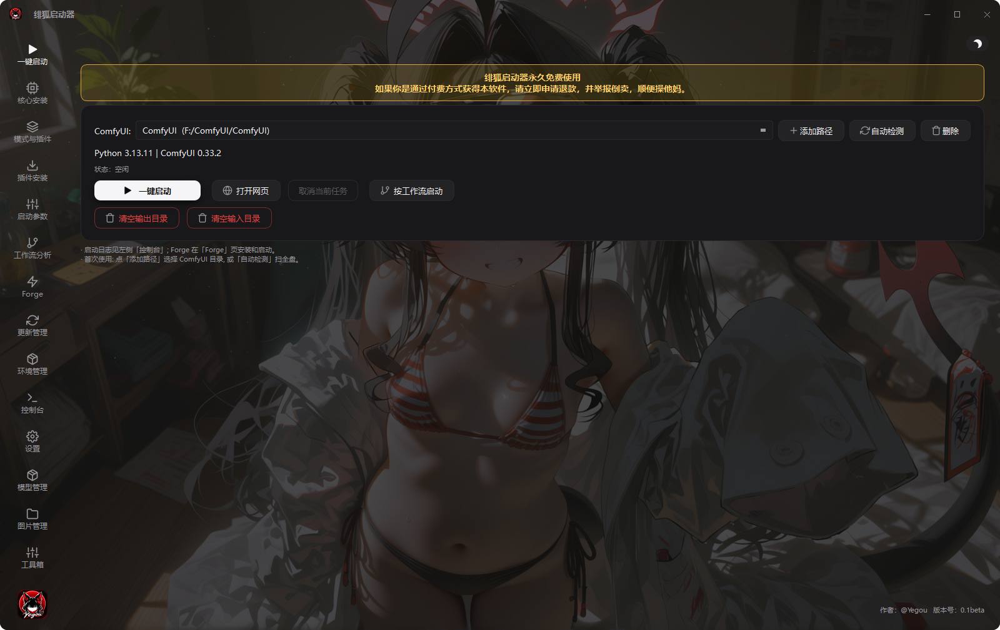
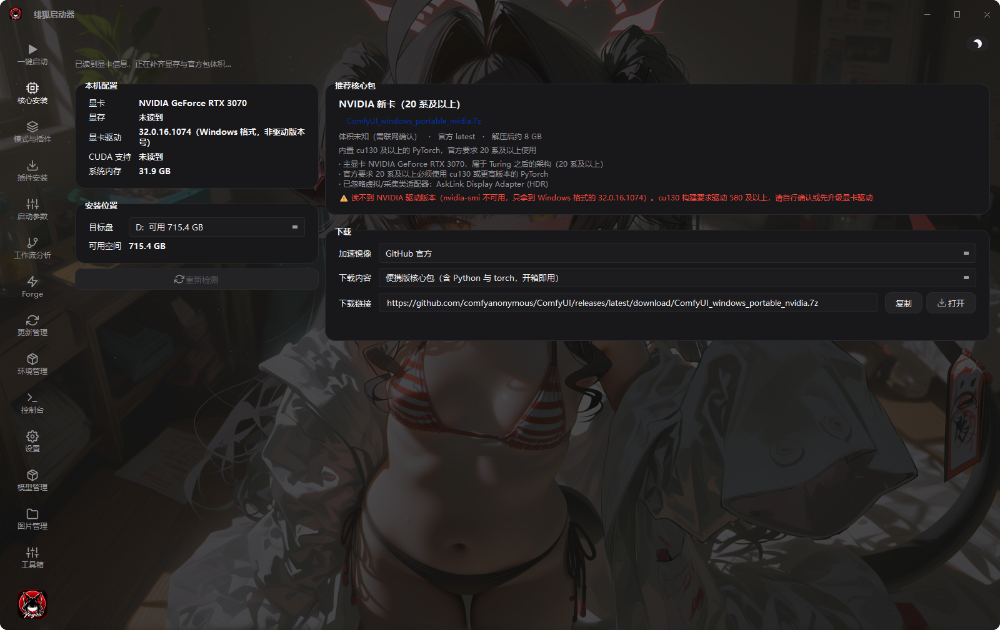
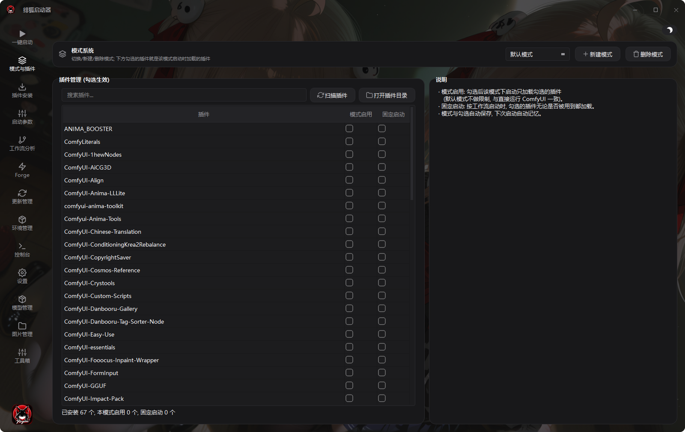
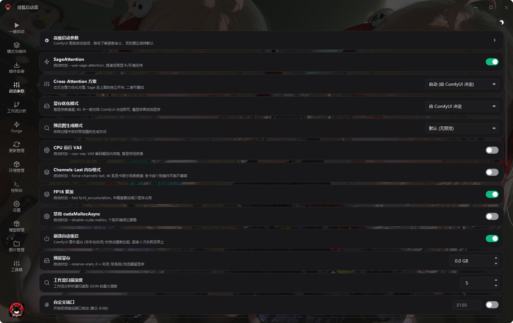
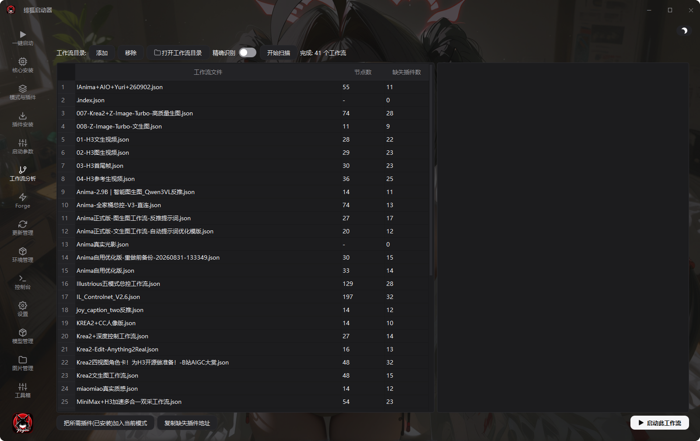
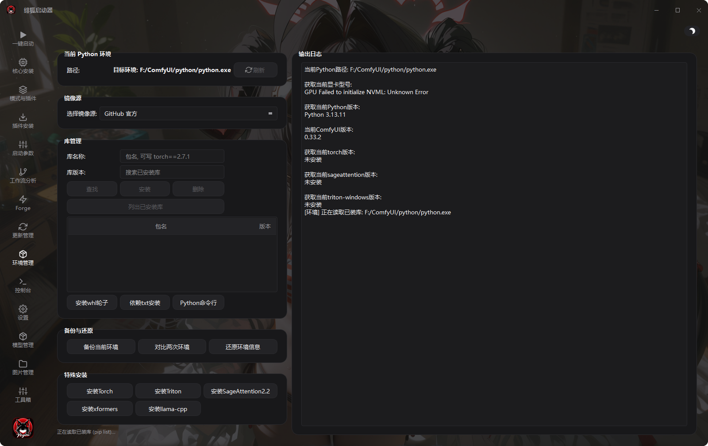
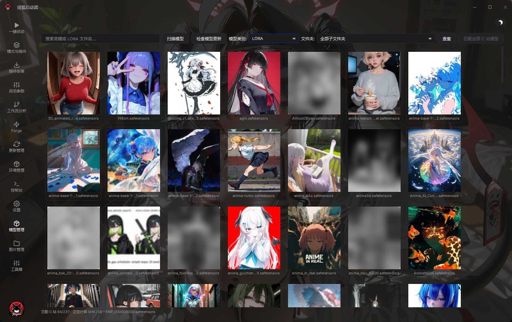
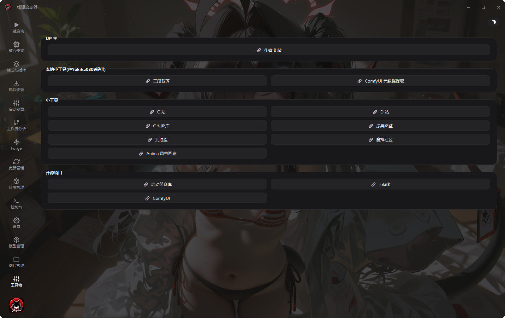

# 绯狐启动器

> **当前版本：v0.5（正式版）** · 2026-09-11

绯狐启动器是面向 ComfyUI 的 Windows 启动与维护工具。它集中管理 ComfyUI 路径、插件、启动参数、工作流、模型和输出图片，并支持以独立 EXE 运行。

> 绯狐启动器永久免费使用。若通过付费方式获得本软件，请立即申请退款，并举报倒卖。

## 界面预览

### 一键启动



### 核心安装

按本机配置推荐合适的官方 ComfyUI 便携版核心包，给出体积、推荐理由与下载链接。



### 模式与插件

按场景保存插件组合，启动前选择要加载的模式。



### 启动参数

显存模式、精度、SageAttention、端口等参数的集中开关。



### 工作流分析

扫描工作流目录，列出节点、模型引用、分辨率、采样步数和缺失插件。



### 环境管理

Python 环境、已安装库与版本信息，支持依赖安装、升级和卸载。



### 控制台

ComfyUI 日志与启动器日志分区显示，支持错误高亮和目录快捷入口。


### 模型管理

按类型与子文件夹浏览模型，瀑布流卡片显示 C 站封面，支持搜索、查重、匹配和前往 C 站。



### 图片管理

图片管理由启动器打开独立的「绯狐图片管理器」窗口，打开即自动扫描输出目录。


### 工具箱

内置工具箱聚合了常用网站入口与本地离线小工具。



## 功能一览

| 模块 | 作用 |
| --- | --- |
| 一键启动 | 选择 ComfyUI 实例并直接启动；服务就绪后可打开网页。启动命令会写入日志，并自动检查 GitHub 正式 Release 的启动器更新。 |
| 核心安装 | 检测本机显卡、驱动、显存、内存和磁盘，按配置推荐对应的官方便携版 ComfyUI 核心包，也可切换下载「仅 ComfyUI 本体」源码；两者共用一个下载入口与全局加速镜像。 |
| 路径配置 | 添加多套 ComfyUI 与 Python 路径，自动检测 Python 和 ComfyUI 版本。 |
| 模式与插件 | 按场景保存插件组合；非默认模式可只加载选中的插件，减少启动冲突。 |
| 插件安装 | 扫描已安装插件，查看缺失插件，打开插件目录，并从 GitHub/下载地址安装。 |
| 启动参数 | 配置 SageAttention、FP16 累加、显存模式、GPU、端口、预览方式、精度和自定义环境变量。 |
| 工作流分析 | 扫描工作流目录，识别节点、模型引用、分辨率、采样步数和缺失插件。 |
| Forge | 管理 Forge 目录、安装依赖并启动 Forge。 |
| 更新管理 | 检查并更新 ComfyUI，支持 release/latest 通道和更新镜像设置。 |
| 环境管理 | 查看 Python 环境和已安装库，执行依赖安装、升级和卸载。 |
| 控制台 | 分开展示 ComfyUI 与启动器日志，支持中文编码回退、错误高亮和目录快捷入口。 |
| 模型管理 | 按 checkpoints、diffusion_models、LoRA、VAE、CLIP 等类型和子文件夹浏览模型；瀑布流卡片按 C 站封面显示，支持搜索、扫描、查重、批量匹配 C 站、打开目录和前往 C 站页面。 |
| 图片管理 | 以独立的「绯狐图片管理器」窗口运行，打开即自动扫描 ComfyUI 的 `output` 目录；瀑布流浏览、全屏灯箱看图，支持多选删除、打包 ZIP 和清空输出目录。 |
| 工具箱 | 聚合常用网站入口（作者 B 站、C 站、D 站、图库、法典图鉴、Hugging Face、魔搭社区、Anima 风格画廊等），并内置完全离线的本地小工具：三段裁剪、ComfyUI 元数据提取。 |
| 设置 | 更换界面背景图并调整压暗程度；深色/浅色主题可在标题栏右上角一键切换。 |

## 快速开始

### 使用 EXE

1. 从仓库 Releases 下载 `FeiHu-ComfyUI-Launcher-v0.1.zip`，解压得到「绯狐启动器」文件夹。
2. 文件夹内有 `绯狐启动器.exe` 与 `绯狐图片管理器.exe`，请让两者保持**同一目录**（启动器的「图片管理」需要调用同目录的图片管理器）。
3. 把文件夹放到固定目录运行。首次打开时，在路径配置中选择 ComfyUI 根目录和对应的 `python.exe`。
4. 点击“一键启动”。启动器会直接执行最终命令，不再弹出二次确认；命令仍会记录在控制台日志中。
5. 状态依次显示为“启动中”“服务已就绪”。服务就绪后点击“打开网页”。

### 更新启动器

启动器打开后会在「一键启动」页后台检查 GitHub 最新正式 Release。发现新版时，按钮会显示“一键更新至 vX”；更新包只接受 `FeiHu-ComfyUI-Launcher-vX.Y.zip` 正式附件，下载后校验 SHA256 与运行库结构，再由独立更新器完成替换和重启。

更新会替换启动器、图片管理器及其运行库，保留 `launcher_config.json`、本地路径、背景图、缓存与日志。发布新版时，使用 `tools/push_release.py` 上传 ZIP；脚本会同时上传同名 `.sha256` 校验附件。

### 从源码运行

要求 Python 3.11 或更高版本，并安装 PySide6：

```powershell
.venv\Scripts\python.exe main.py
```

也可以使用：

```powershell
启动启动器.bat
```

## 核心安装

启动器本身是「启动与维护工具」，**不自带 ComfyUI 核心**。如果你还没有 ComfyUI，可以用「核心安装」页按本机配置挑一份官方便携版核心包。

点开这一页会自动检测：显卡型号与显存、显卡驱动、驱动支持的最高 CUDA 版本、系统内存、各磁盘可用空间，然后按官方分档规则给出推荐：

| 你的显卡 | 推荐的核心包 |
| --- | --- |
| NVIDIA 20 系及以上（含 30 / 40 / 50 系与 GTX 16 系） | `ComfyUI_windows_portable_nvidia.7z`（内置 cu130 及以上 PyTorch） |
| NVIDIA 10 系及更老 | `ComfyUI_windows_portable_nvidia_cu126.7z`（Python 3.12 + cu12.6） |
| AMD | `ComfyUI_windows_portable_amd.7z` |
| Intel | `ComfyUI_windows_portable_intel.7z` |

几点说明：

- 官方要求 20 系及以上必须使用 cu130 或更高版本，**不要**在 20 系及以上的卡上使用 cu126 那个包。
- 显存大小**不影响**选哪个包，只影响能跑多大的模型和该用哪种显存模式。
- 驱动版本是关键门槛：cu130 需要 580 及以上的显卡驱动。检测结果里会直接标出驱动支持的最高 CUDA 版本。
- 核心包里**不含任何模型**，装完是干净的环境，模型需要另外下载。
- 下载链接默认走 GitHub 官方地址；如果你在国内，可以在「加速镜像」里选 ghfast / gh-proxy，链接会立刻跟着变。
- 「下载内容」里可以切换两种东西：
  - **便携版核心包** —— 就是上面表格里的 7z 包，内置 Python 与 PyTorch，解压即用；
  - **仅 ComfyUI 本体** —— 官方仓库的源码 zip，解压后得到的目录和整合包里的 `ComfyUI` 文件夹内容一致（不含 `custom_nodes`、`models` 等附加内容），需要自备 Python + PyTorch 环境；已有环境想更新版本时用它最省事。
- 「加速镜像」是**全局设置**：插件安装 / 核心安装 / 环境管理 / 更新管理 四个页面共用同一份配置，在任何一处改动，其余几处会立刻同步，不会出现「同一个设置显示好几个不同值」的情况。

## 启动参数建议

8GB 显存建议使用普通显存模式，不要默认添加 `--highvram` 或 `--disable-dynamic-vram`。SageAttention 和 FP16 累加可按环境开启；显存预留建议从 0 开始，遇到模型反复加载时优先检查显存预留、工作流中的清理显存节点以及其他 GPU 程序。

启动前会检查重复参数、显存模式冲突和全局精度冲突。高级参数除非明确知道含义，否则建议保持默认值。

## 图片管理

图片管理由启动器打开独立的「绯狐图片管理器」窗口运行，打开后自动扫描：

```text
<ComfyUI目录>\output
```

- 瀑布流浏览图片，点击任意图片进入全屏灯箱：左右方向键或左右按钮翻页，点图片周围的暗区或右上角关闭按钮退出。
- 开启多选后，点击图片左上角的方框进行选择。选择完成后可删除图片或打包为 ZIP。
- 压缩包默认使用当天日期命名，也可以在保存对话框中修改。

## 模型管理

模型按照 ComfyUI 的目录类型分开显示，并保留子文件夹层级，卡片以瀑布流形式排布并显示 C 站封面。

- 顶部工具栏可搜索底模或 LORA 文件名、切换模型类别与子文件夹、扫描模型、检查更新、查重，以及批量匹配 C 站。
- 右键模型可以打开所在目录、打开已匹配的 C 站页面或执行删除操作。删除模型前会弹出二次确认。
- 模型匹配和封面获取需要网络可用。已匹配项目会使用本地缓存，避免重复请求。

## 工具箱

工具箱分为两部分：

- **常用网站入口**：作者 B 站、C 站、D 站、图库、法典图鉴、Hugging Face、魔搭社区、Anima 风格画廊等，点击即在浏览器打开。
- **本地小工具（完全离线）**：三段裁剪、ComfyUI 元数据提取。图片与元数据全程在本机处理，不上传、不联网。

## 配置与日志

- 配置文件：`launcher_config.json`
- 配置备份：`launcher_config.json.bak`
- 崩溃日志：`data/crash.log`
- 启动器运行日志：界面中的“启动器/Forge”日志页

配置文件与 EXE 放在同一目录。迁移到新电脑时，可以复制配置文件后重新确认 ComfyUI 和 Python 路径。

## 常见问题

### 启动后一直没有服务就绪

先查看 ComfyUI 日志中的插件错误和端口占用信息。可以在“插件安装”中打开失败插件目录，修复或禁用对应插件。

### 第一次生成很慢

首次加载模型、LoRA、VAE 和文本编码器需要建立缓存，通常明显慢于后续任务。若每次任务都在重新加载模型，请检查是否启用了清理显存节点、`--disable-dynamic-vram`、过高的显存预留，或有其他程序占用 GPU。

### 工作流提示缺少插件

打开“工作流分析”，启动器会合并重复的缺失节点名称，只显示实际缺失的插件，并提供对应安装地址。

### 界面偶尔卡住不响应

启动器检测到界面卡顿时，会自动把当时的调用栈写入 `data/stall.log`。反馈问题时附上该文件，可以直接定位到是哪一步在阻塞。

## 更新日志

### v0.5 正式版 · 2026-09-11

**启动器自更新**

- 「一键启动」页新增启动器更新入口；打开启动器后会在后台自动检查 GitHub 最新正式 Release，发现新版时显示版本与“一键更新”按钮。
- 更新仅接受 `FeiHu-ComfyUI-Launcher-vX.Y.zip` 正式 Release 附件；下载后校验 GitHub SHA256（或同版 `.sha256` 附件）和完整运行库结构，拒绝源码 ZIP、预发布版本及不完整包。
- 更新由独立更新器在主程序退出后完成，替换启动器、图片管理器与运行库，保留本地 `launcher_config.json`、路径、背景图、缓存和日志。
- 发布脚本会同步上传 ZIP 的 `.sha256` 校验附件，供客户端在更新前验证。

**任务通知修复**

- ComfyUI 任务完成通知改为仅识别最终 `Prompt executed` 日志；模型初始化、采样、VAE 等中间阶段到 100% 不再重复弹窗。

### v0.4 正式版 · 2026-09-11

**插件更新**

- 插件更新失败时不再只报"成功 0 个，失败 1 个"：弹窗直接列出每个失败插件的 Git 原始错误，网络 / 远程分支 / 本地文件冲突一眼可辨。
- 两个插件列表的右键菜单新增「打开 GitHub 仓库」：按插件的 `origin` 地址打开，非 GitHub 来源不会误开。
- 更新会直接同步到远程分支并覆盖插件内已修改/未跟踪的文件，更新前自动创建 `ol_backup_时间` 救援分支。

**任务通知**

- 设置页新增「当前任务完成通知」（默认开启）：仅在 ComfyUI 输出最终 `Prompt executed` 完成日志时弹出一次 Windows 托盘通知。
- 移除「连续 180 秒无响应 / 无进度」的弹窗提示，长时间加载模型不再被打断。

**模型更新检查**

- 匹配仍按模型文件 SHA256 精确对应 C 站版本，不做文件名猜测。
- 「发现模型更新」改为可滚动列表，分别显示本地文件名 / 路径、C 站模型名、当前版本与最新版本。

**图片管理器**

- 恢复多选 / 全选后的右键「打包成压缩包」：默认名 `图片打包_当天日期`，可自定义名称与保存位置，同名自动加序号，中断或失败不会留下半截 ZIP。
- 继续以自包含运行包交付，目标电脑无需安装 Python 或 PySide6。

**版本统一**

- 启动器、图片管理器与安装包内部版本统一为 `v0.4`（一键启动页、标题栏、关于页、帮助页与诊断信息显示同一版本）。

### v0.3 正式版 · 2026-09-10

**体验修复**

- 控制台支持**自动换行**：单行超长日志不再把窗口横向撑爆。
- 「从 C 站链接批量下载」防呆改进：
  - API Key 与链接草稿**即时保存**——输入完甚至直接关窗都不会丢，重开自动回填；
  - 弹窗底部新增**实时进度行**，后台下载中打开弹窗也能看到当前进度；
  - 下载进度显示限频刷新并带 ⬇/✅/❌ 状态前缀，不再被其他任务的消息覆盖；
  - 每一步都写入 `data/batch_download.log`，出问题可直接对账；
  - 模型需要登录时明确提示「请填入只读 API Key」（HTTP 401 不再是无声失败）。

**其它**

- 启动器内部版本号与发布版本保持同步（首页右下角跟随显示）。

### v0.2 正式版 · 2026-09-10

**新增：从 C 站链接批量下载模型**

- 模型管理页新增「C 站链接下载」：粘贴一批 `civitai.com` / `civitai.red` 模型链接（支持 `?modelVersionId=` 精确指定版本），自动解析并按 C 站模型类型保存到对应目录（LoRA→loras、Checkpoint→checkpoints、VAE→vae、Embedding→embeddings、ControlNet→controlnet 等），也可在「保存到」里手动指定 models 下的目录。
- **断点续传**：下载中断后下次接着传；已存在的文件自动跳过；`.part` 暂存 + 完成后原子改名，不会留下半截文件。
- **关闭窗口或切换页面都不影响任务**：下载挂在后台线程，进度实时显示在模型页状态栏，全部完成后自动重扫、新模型直接入列。
- 「生成 API Key」一键打开 civitai.red 账户页；Key 只需只读权限，配置一次长期使用。
- 接口优先走 civitai.red 镜像（国内直连），失败自动退回 civitai.com。

**新增：核心安装**

- 新增「核心安装」页：自动检测显卡型号、显存、显卡驱动与驱动支持的最高 CUDA 版本、系统内存和各磁盘可用空间，按官方便携版分档规则推荐对应的核心包，并给出体积、推荐理由、风险提示和下载链接。
- 「下载内容」可在**便携版核心包**和**仅 ComfyUI 本体**（官方源码，解压后与整合包里的 `ComfyUI` 目录一致）之间切换，两者共用一个下载入口。
- 支持 ghfast / gh-proxy 镜像加速，切换后下载链接立即更新。
- 探测分两批返回：先出显卡、内存、磁盘（秒级），再补齐显存与官方包体积；全程在后台线程，不阻塞界面。

**稳定性：修复两大「未响应」顽疾**

- 修复**启动时未响应**：原先启动器会在主线程同步启动便携 Python 读取版本号（实测 0.3~4.5 秒，杀毒软件/磁盘繁忙时更久），期间整个窗口无响应。现在版本探测移入后台线程并带缓存，窗口秒开。
- 修复**滑动模型页未响应（死锁）**：视频封面抽帧线程会和主线程互相等待造成永久死锁（只能杀进程）。已彻底移除视频抽帧：已抽取过的视频首帧照常显示，其余视频封面显示占位图；安装包也因此减小约 10MB。
- 新增 GIL 免疫卡顿取证：再遇到"未响应"，启动器会自动把当时**所有线程的调用栈**落盘（`data/hangdump.log`），问题可精确归因。

**修复与改进（启动器）**

- 修复「按工作流启动」点了没反应：弹窗默认只列出该工作流**需要**的插件（其余 60+ 插件隐藏，可开关显示全部），异常不再被静默吞掉。
- 插件安装 / 核心安装 / 环境管理 / 更新管理 四处的「GitHub 加速镜像」下拉合并为**同一份配置**，任意一处改动其余立即同步；核心安装页下载入口也合并为一个。
- 主页信息条的 Python 版本探测改为后台加载 + 进程内缓存，环境管理「特殊安装」不再重复探测。
- 页面序号改为按名字查（`page_index`），以后新增页面不再需要同步修改一批硬编码数字。

**图片管理器更新**

- 卡片留白加大：缩略图间距更宽松，框选更好点。
- 新增图片**实时显示**：往目录里加新图立即出现，不再需要手动全量重扫；扫描改为增量（未变化的文件直接跳过），大目录也快。
- 新增「使用说明 / 快捷键」弹窗：包含全部快捷键（Ctrl+A 全选、Esc 取消、←→ 翻页、Ctrl+滚轮缩放、Shift/Ctrl+点选、`rating:`/`tag:`/`model:` 等筛选语法）。

**内部改动**

- 卡顿取证体系升级：原 StallWatch（主线程心跳）之外新增 faulthandler 全线程栈看门狗，能抓到"主线程被 C 层锁/GIL 抱死"这类旧机制看不见的死锁。

### v0.1 正式版 · 2026-09-10

首个正式发布版本。这一版的重点是把卡顿打掉，同时精简界面。

**性能**

- **启动不再卡 3 秒**：环境管理页原先在构建界面的同时同步起子进程读取 ComfyUI 便携 Python 的版本号，导致每次打开启动器都要阻塞约 3.2 秒。现已改为后台线程探测，界面先显示“读取中…”，结果回来再填。实测 3210 ms → 0 ms。
- **主题切换秒切**：深浅色切换原先是对整个程序重新套用样式表，会连带 13 个页面的 817 个控件一起重新计算，其中 600 多个还在看不见的隐藏页上。改为“调色板换色 + 只重刷标题栏 / 侧栏 / 当前页，隐藏页进入时再补”后，一轮换肤 946 ms → 65 ms（点击后 76 ms 返回）。
- **拖动、切换模型列表不再卡死**：视频封面首帧抓取原先跑在主线程，单次会阻塞 145~286 ms，表现为滚过视频卡片就“未响应”。现已搬进独立线程，并加上 220 ms 限流与“滚动中不抓”；主线程最大停顿 286 ms → 12 ms。模型列表内不再自动播放视频，只显示静态首帧。
- **模型瀑布流真虚拟化**：只渲染可视区卡片，并复用已创建的卡片控件。类别、文件夹切换最差耗时 474 ms → 52 ms。
- **C 站封面查表缓存**：冷启动解析耗时 101 ms → 0。

**界面**

- 移除模型管理页顶部多余的「模型管理」标签栏，工具栏直接顶到内容区。
- 新增卡顿取证：界面卡顿超过 1.5 秒会把当时的调用栈写入 `data/stall.log`。反馈问题时附上这一文件，可以直接定位到卡在哪一步。

**工具箱**

- 三段裁剪精简为「整图遮挡」与「分段裁剪」两种模式。

**图片管理器**

- 图片管理由启动器打开独立的「绯狐图片管理器」窗口，打开即自动扫描输出目录；支持瀑布流浏览、全屏灯箱翻页、多选与框选、批量删除和打包 ZIP。

## 开源与许可

启动器发布包为预编译 EXE，不包含本项目源代码。ComfyUI、插件和模型遵循各自项目及作者的许可证。

项目地址：[lsloveppc/FeiHu-ComfyUI-Launcher](https://github.com/lsloveppc/FeiHu-ComfyUI-Launcher)

作者：[B 站](https://space.bilibili.com/2230608?spm_id_from=333.1007.0.0)
